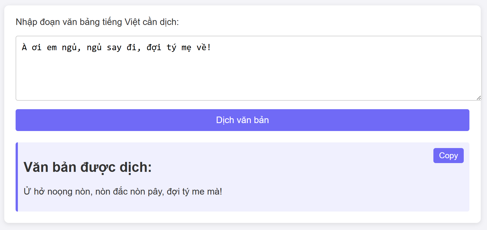

# Tiếng Việt sang tiếng Tày


Ứng dụng hỗ trợ dịch từ tiếng Việt sang tiếng Tày

## Khởi chạy ứng dụng

```commandline
python app.py
```

Sau khi khởi động, ứng dụng sẽ tạo một web server có đoạn chat riêng tại địa chỉ http://127.0.0.1:5000 (mặc định của Flask):



## Dành cho nhà phát triển

### Thêm nội dung vào từ điển

Để bổ sung các từ ngữ được dịch từ tiếng Việt sang tiếng Tày, thêm nội dung vào các file `csv` tương ứng trong folder `dictionary` theo cấu trúc bảng như sau:

|tieng_viet|tieng_tay|
|-|-|
|một|nừng|
|hai|soong|

### Chạy test bản dịch

Sửa nội dung văn bản cần dịch trong hàm chạy công cụ dịch `translate`.

Sau đó chạy file:

```commandline
python test.py
```

---

Version (beta) 0.5.0

